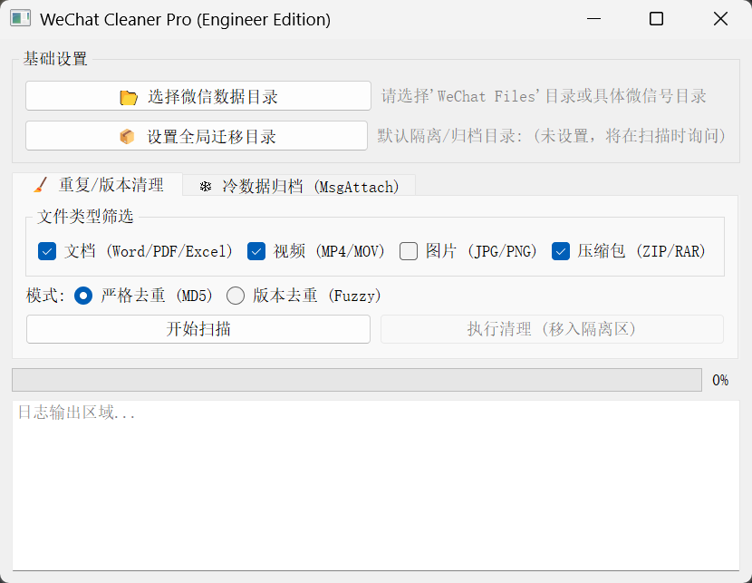

# 微信文件重复清理工具

这是一个用于清理微信文件夹中重复文件的图形界面工具。针对微信转发文件会生成多个副本、长期占用大量磁盘空间的问题，本工具提供了**数据去重**和**冷数据归档**两套并行解决方案。

本工具利用分层混合的方式，在尽量保证数据安全的前提下最大化释放磁盘空间。

## 页面截图



## 功能特点

### 1. 混合去重策略

根据文件特征自动切换算法：

* **小文件 (< 1MB)**：采用 **MD5 严格比对**。确保头像、表情包、缩略图等只有在内容完全一致时才被清理，防止误删。
* **大文件 (≥ 1MB)**：采用 **Fuzzy 模糊版本分析**。
* 针对文档（Word/PPT/PDF）和视频，结合**文件大小差异**（<30%）与**文件名相似度**（正则+编辑距离）。
* 能识别如 `报告.docx`、`报告(1).docx`、`报告_副本.docx` 等同一文件的不同版本，保留**最新修改**的版本。

### 2. 冷数据归档

主要针对 `MsgAttach` 中大量加密或未知的旧文件（通常半年前的聊天记录之间的转发关系已无用但占用巨大空间）：

* 自动扫描微信目录下的所有微信号。
* 可自定义（如 180 天），将长期未修改的文件迁移到移动硬盘或备份目录。

### 3. 隔离机制

* 所有被判定为“重复”或“冷数据”的文件，**不会被直接删除**。文件会被移动到你指定的“隔离文件夹”，并保持原有的目录结构，还原时可以直接剪切回去。


## 使用说明

确保你的环境中安装了 Python 3.6+，然后安装 UI 依赖：

```bash
pip install PyQt5
```

运行工具：

```bash
python wechat_cleaner.py
```

设置路径：
* 点击“选择微信数据目录”（通常是 `Documents/WeChat Files` 或具体微信号文件夹）。
* 点击“设置全局迁移目录”（用于存放清理出来的文件）。


选择功能模式：
* **Tab 1：重复/版本清理**
* 勾选需要扫描的文件类型（文档/视频/压缩包）。
* 选择策略：推荐使用默认的**混合策略**（大文件模糊去重，小文件严格去重）。
* 点击“开始扫描” -> 查看报告 -> 点击“执行清理”。

* **Tab 2：冷数据归档**
* 设置天数阈值（例如 180 天）。
* 点击“扫描并迁移冷数据”。

## 技术架构

本项目采用 MVC 变体架构设计：

* **GUI (View)**: 基于 `PyQt5`，提供 Tab 分页与实时日志反馈。
* **Scanner (Controller/Worker)**: `QThread` 多线程调度，防止界面冻结。
* **Core Logic (Model)**:
* `difflib` + `Regex`：实现文件名的高级模糊匹配。
* `Sliding Window`：滑动窗口算法优化大文件比对效率，减小复杂度。
* `SQLite`：中间态数据存储，支持海量文件分析。


## 📂 项目结构

```text
├── wechat_cleaner.py  # [入口] 图形界面主程序
├── scanner.py         # [核心] 混合扫描算法、哈希计算、模糊逻辑
├── db_manager.py      # [数据] SQLite 数据库管理
└── README.md          # 说明文档

```

## 项目来源与致谢

本项目 Fork 自 [loivon/WeChat_duplicate_file_cleanup_tools](https://github.com/loivon/WeChat_duplicate_file_cleanup_tools)，并在其基础上进行了不算小的重构与功能增强。

**主要改进包括：**

1. 重构为混合去重算法（Strict + Fuzzy）。
2. 新增冷数据（MsgAttach）分层存储功能。
3. 将“直接删除”改为“移动隔离”，提升安全性。
4. 优化 UI 交互逻辑与多线程稳定性。

感谢原作者提供的基础框架与灵感。

## ⚠免责声明

* 本工具采用“移动”而非“删除”策略，理论上是安全的。
* 但在清空“隔离区”之前，请务必确认文件不再需要。
* 作者不对因使用本工具导致的任何数据丢失或微信异常负责。

## 许可

MIT License